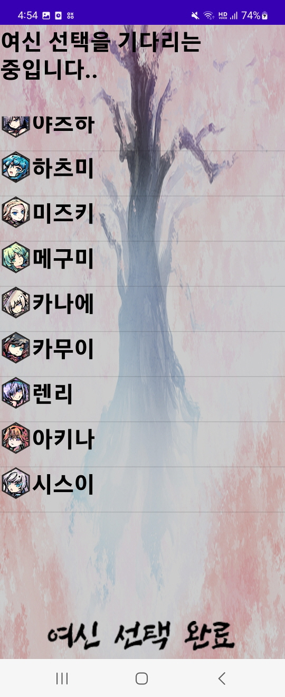
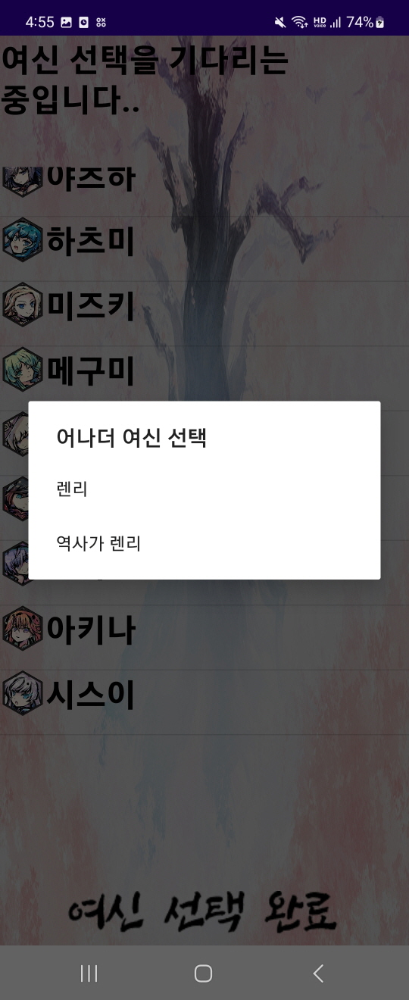
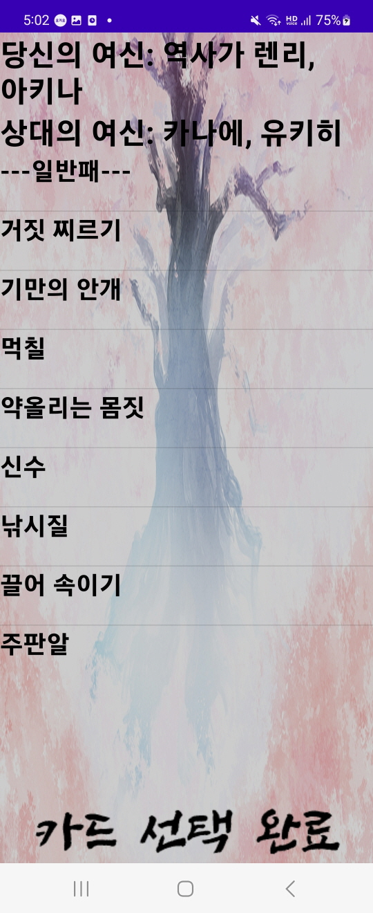
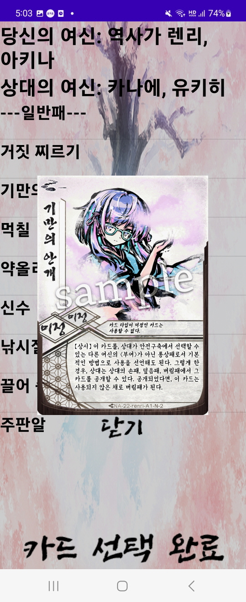
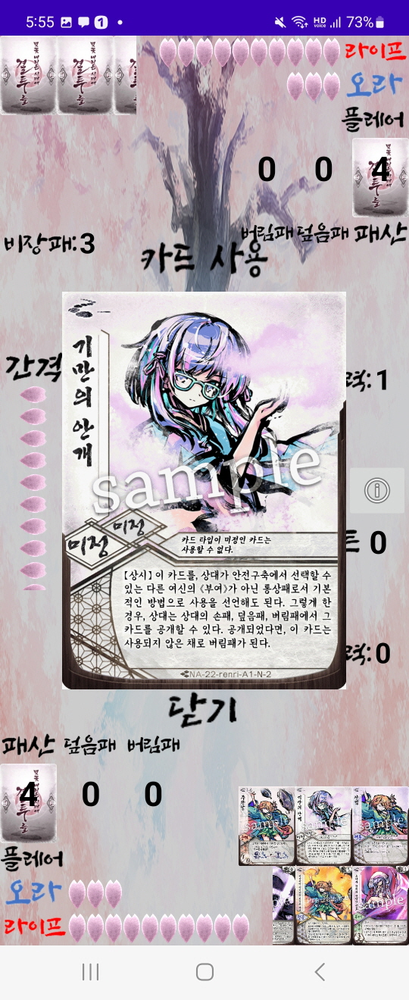
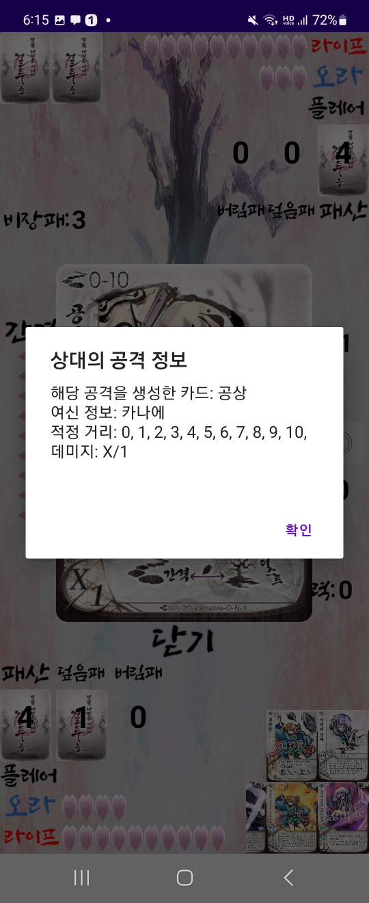
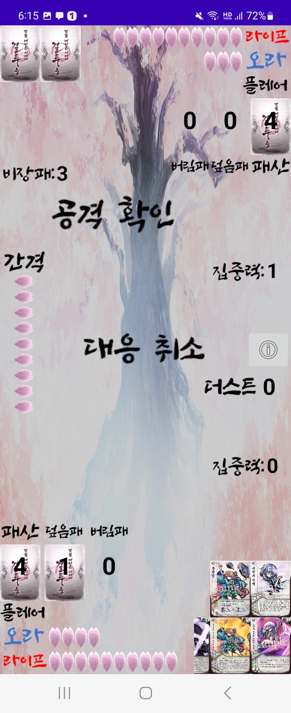
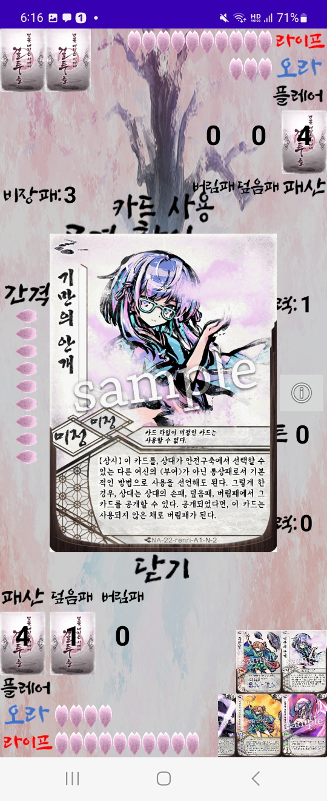

# sakura arm's rule processor
해당 프로젝트는 카드 게임 후루요니의 온라인 게임 플레이 지원 및 자동 자원 관리를 위한 서버 프로젝트다.

아래에는 해당 서버를 이용하는 클라이언트 프로그램의 사용법 및 구성화면 요소를 간단히 소개한다.

## 1. 시작 화면

앱을 실행하면 위와 같은 화면이 나오고, 제목 밑의 방 만들기 버튼을 누르면, 방 번호가 나오게 된다

상대편은 참가하기 버튼을 눌러서 해당 방 번호를 입력해서 게임을 시작할 수 있다.

## 2. 방 생성 화면

## 3. 참가하기 화면

  

## 4. 게임 시작 전 준비
그렇게 양 플레이어가 참여하게 되면, 사전 과정을 통해 게임의 세부사항이 결정되게 된다. (해당 사항은 방 생성자가 결정하게 됨)

아래와 같은 화면을 2번 걸쳐, 버전과 모드(밴픽 여부)를 결정하게 된다.

 

세부사항을 결정한 뒤에는 아래와 같은 케릭터 선택 창이 나오게 된다.

결정한 세부사항에 따라 2명 내지 3명의 여신을 골라 양쪽 다 선택 완료를 누르게 되면 카드 선택으로 넘어가게 된다 
(어나더 여신의 경우 원본 여신을 클릭 한뒤 선택창에서 선택 가능하다)

    

카드 선택 화면은 아래와 같고, 카드 선택의 경우 카드이름을 짧게 클릭, 실재 카드 이미지를 보고싶은 경우에는 카드이름을 길게 클릭하면 된다.

총 7장의 일반패, 총 3장의 비장패를 선택 한 뒤, 양쪽 다 선택 완료를 누르면 실재 게임으로 넘어가게 된다.

    

## 5. 실재 게임 화면  

실재 게임화면은 위와 같습니다.

1번 영역은 상대의 손패 영역으로 뒷면이 표시되어, 독과 구별할수 있습니다.

2번 영역은 상대의 부여패 영역으로, 상대가 사용한 활성화 된 부여패는 2번 영역으로 이동하고, 
카드 바로 아래에 씨앗 결정(초록색)과 벚꽃 결정(분홍색)의 갯수가 표시됩니다

3번 영역은 상대의 사용 완료된 비장패 영역으로, 상대가 사용한 비장패는 일반적으로 저장소로 이동합니다.
이하 설명은 부여패와 같습니다.

5번 영역은 당신의 사용 완료된 비장패 영역으로, 이하 설명은 상대의 사용 완료된 비장패와 같습니다.

6번 영역은 당신의 부여패 영역으로, 이하 설명은 상대의 부여패 영역과 같습니다.

7번 영역은 당신의 손패 영역으로, 당신의 턴 중 상호작용 가능한 영역입니다. 해당 영역의 카드를 클릭시 중앙에 카드가 확대되고, 
사용하거나, 기본동작을 하는데 사용할수 있습니다.

8번 영역은 당신의 비장패 영역으로, 당신의 턴 중 상호작용 가능한 영역입니다. 해당 영역의 카드를 클릭시 중앙에 카드가 확대되고,
플레어를 지불해 사용할 수 있습니다.

9번 영역의 경우 당신의 패산, 덮음패, 버림패를 클릭하면, 해당 영역에 있는 카드들이 표시가 되고 손패나 비장패와 마찬가지로
카드를 확대하고, 사용할 수 있는 카드의 경우에 한해서만 사용할 수 있습니다.

4번은 여신 추가 정보 버튼으로, 어나더 하가네, 신라와 같은 추가 보드,
혹은 추가 영역이 필요한 여신의 경우 해당 버튼을 눌러서 나오는 패널에 표시가 됩니다. (해당 이미지는 아래에 첨부합니다)

집중력의 경우 아래와 같이 표시되며 위축의 경우 집중력 텍스트가 하얗게 되는것으로 표시됩니다.

## 6. 유저 상호 작용 및 세부사항

### 1. 기본상호작용

유저가 게임진행과 관련된 상호작용할 수 있는 영역은 위와 같이 두가지가 있다. 
첫번째는 중간에 있는 턴 종료버튼과 기본동작(집중력) 버튼
두번째는 당신의 비장패영역과 손패영역

기본동작(집중력) 버튼의 경우 누를시 집중력을 1 지불해서 기본동작을 할 수 있다.

턴종료 버튼의 경우 누를시 메인 페이즈를 종료하고 당신의 엔드 페이즈로 넘어가게 된다

비장패 영역과 손패 영역의 카드를 클릭시 아래와 같이 중간에 카드가 확대되고 카드 사용 버튼을 누를시 아래와 같은 다이얼로그가 뜨면서 카드를 사용하거나(카드 사용 버튼),
손패 카드일시 뒷면으로 덮음패로 이동시켜(기본동작 버튼) 기본동작을 할 수 있다.

    

### 2. 공격과 대응

상대 혹은 내가 카드 사용을 통해 공격을 수행하면 아래와 같이 버프가 적용되지 않은 공격에 대한 기본 정보가 제공되고 확인을 누르면, 해당 공격을 트리거한 카드가 확대되어 있다.
공격 정보를 닫기를 통해 제거한뒤, 해당 공격에 대한 대응 여부를 결정할 수 있고, 일반적인 카드를 사용하듯 카드를 사용해 대응을 수행할 수 있다.

  

### 3. 부여패

부여패를 사용하면 아래와 같이 납을 어떻게 진행할지 결정할 수 있는 다이얼로그를 받을 수 있는데, 더스트 옆에 빈공간에, 더스트에서
보낼 벚꽃결정의 숫자를 입력후 확인을 누르면, 서버에서 납을 진행하게 된다. 만약 더스트에 입력한 숫자만큼 벚꽃결정이 없을시, 재요청을 하게 된다.

  

부여패의 경우 올려진 벚꽃 결정이 0가 되면 파기를 진행하게 되는데, 개시 페이지에서 여러개의 부여패가 동시에 파기되면, 활성 플레이어(턴 플레이어)가
부여패의 파기 순서를 결정하게 된다.

  

위의 사진에 영역에서 나타난 부여패를 하나씩, 손패나 비장패에서 카드를 사용하듯이 카드 선택버튼을 눌러 파기 시키면 된다.(사진에는 없지만, 
상대방에게도 파기 될 부여패가 있다면 해당 영역에 나타나게 된다)

### 4. 카드 효과

몇몇 카드는 여러 효과들 중에 하나의 효과를 선택하게 되는데 그 경우, 아래와 같은 다이얼로그가 나오게 된다. 가능한 선택지 중에서 하나를 고르면 된다.

### 5. 카드를 선택하는 카드 효과  

몇몇 카드는 특정 영역에서 카드를 골라서, 어떠한 효과를 불러일으키는데, 그 경우 아래와 같은 순서로, 카드를 고르게 된다.  

### 1. 카드 효과에 대한 안내문
   

위와 같은 안내문이 나오게 되고, 해당 안내문을 참고해서, 카드를 선택한다  

### 2. 카드 선택
  

부여패 처럼 왼쪽 위에 선택 가능한 카드가 나오게 되고 해당 카드들을 클릭하면 아래와 같이 카드가 확대되서 나온다.

  

카드 선택 버튼을 누르게 되면 해당 카드는 위에서 바로 아래로 다음 이미지와 같이 이동하게 된다.  

  

### 3. 선택 종료  

조건에 맞춰서, 카드를 선택하고 나면 선택 종료 버튼을 눌러서 선택을 마치면 된다. (조건에 맞지 않는 선택시 재선택을 요구)  

## 7. TODO
### 1. 웹 버전? 혹은 window 환경에서 구동가능한 버전?
### 2. 효과 선택의 가시성 - 몇몇 카드에만 적용 완료
**상대가 카드의 효과를 선택할 때 특정 효과는 토큰의 움직임만으로 어떤 선택을 했는지 알 수 없는 경우가 존재**
### 3. 카드의 번역명이 바뀐 케이스
**이미지와 게임화면 상의 카드  이름이 다름**
### 4. 여신의 도전 모드 수록
### 5. 신라의 계략을 따로 텍스트로 만들고 전개시, 파기시, 사용 와 같은 태그에서 해당 텍스트를 발동시키는 역할만하게 바꿔야함

